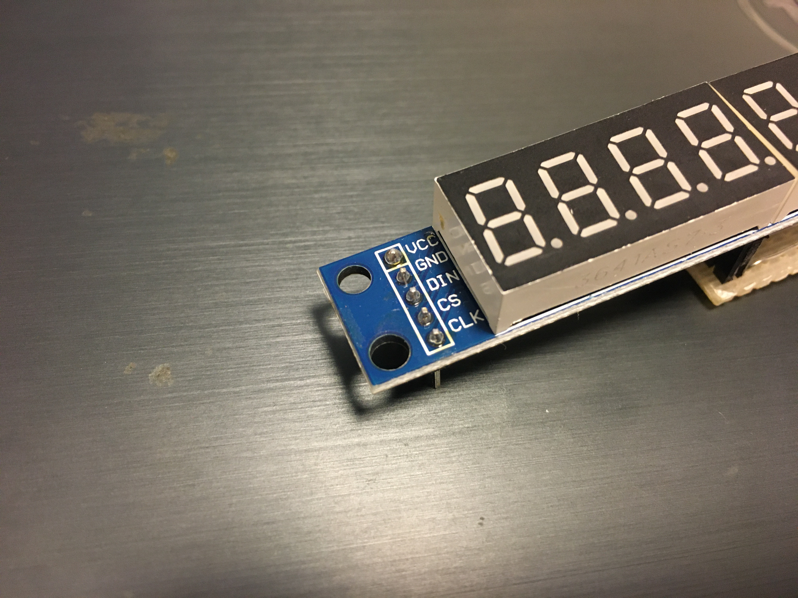
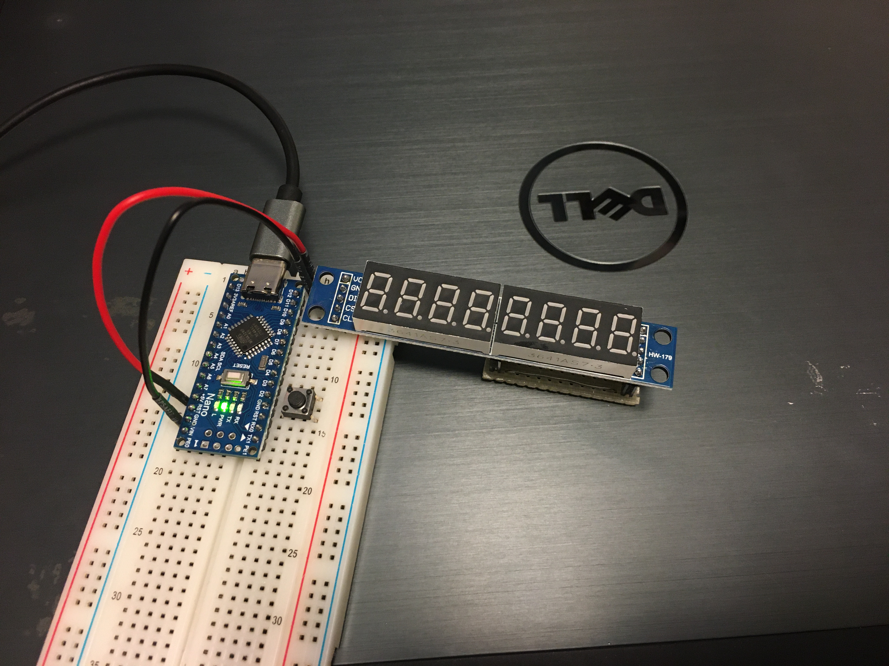
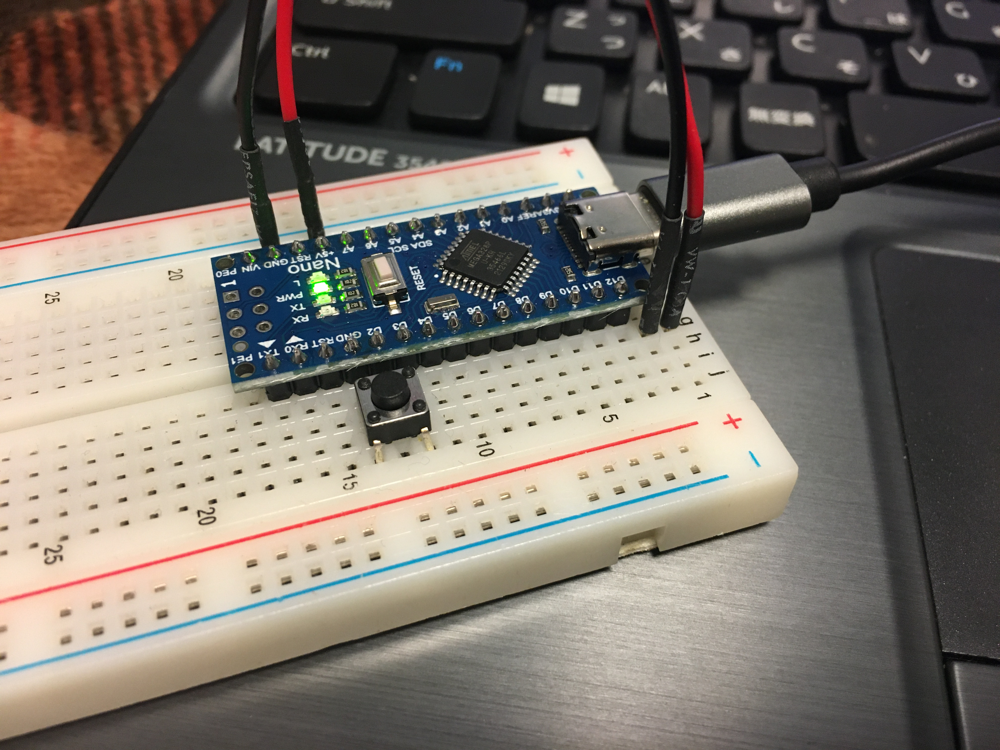
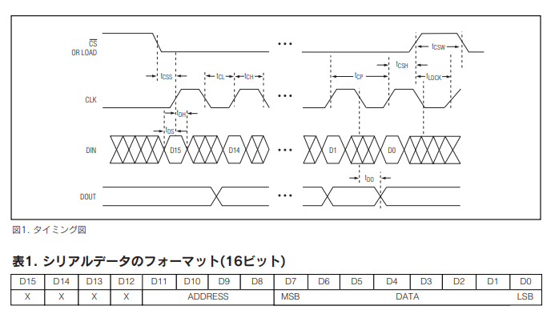
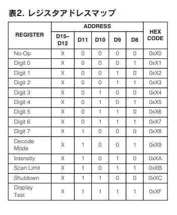
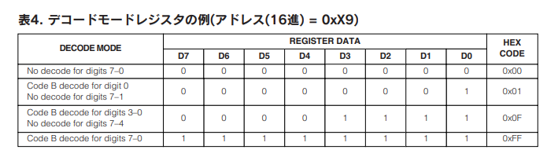
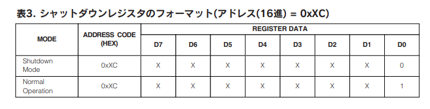
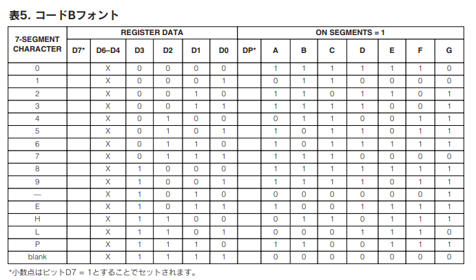
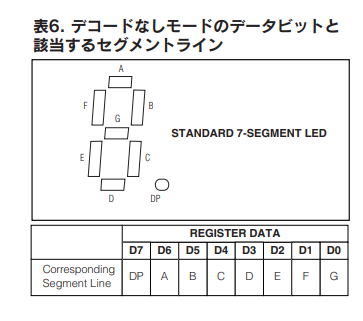

# About

MAX7219内蔵の8桁7セグメントLEDディスプレイをドライブするコードです。本コードでは以下の回路図を用いているものとして書いていますので必要に応じて変更してください 
[購入元](https://www.amazon.co.jp/dp/B09FZ4S5JQ/) 

# 製品仕様

制御用のICにMAX7219を搭載した7セグメントLEDです 
基板についている端子は上から順にVCC, GND, DIN, CS, CLKです。 

各端子の役割を以下に示します

| 端子名 | 役割 | 使い方 |
|----|----|----|
| Vcc | 電源 | マイコン等から5Vを供給する |
| GND | グランド | 基準電位となる |
| DIN | デジタル信号入力 | レジスタに送るデータを入力 |
| CS | チップセレクト | 送信する前にLOWにし、送信が完了したらHIGHにする |
| CLK | クロック | レジスタのデータをシフトさせるクロック信号を入力 |

# 回路図（ブレッドボード）

このように繋ぐと、 

D12 <--> DIN 
D11 <--> CS 
D10 <--> CLK 

となります。電源は届きようがないのでジャンパ線を使用します 

操作用にタクトスイッチも入れています。GNDとD3に繋がっていて、内部プルアップを使用することでプルアップ抵抗を削減しています

# レジスタ関連

レジスタに送信するデータは16bitで構成されています。LSBから順にデータ8bit、アドレス4bit、割り当てなし4bitです

動作はこのようになっています

データを送信する前にCSをLOWにし、DINに送信したいデータを入れてCLKを叩きます。DINにはMSBから送信します。
つまり、0を4bit、レジスタアドレス4bit、データ8bitの順になります。Arduino標準の`shiftOut();` 関数が便利です

## レジスタアドレスマップ

レジスタに送信するデータは上記の表の通りです。0x00 ~ 0x0Fの範囲で指定します

デコードモードレジスタ、シャットダウンレジスタへの送信データは以下の通りです

デコードモード無効時に送信するデータと各bit-LEDの対応は以下の通りです

